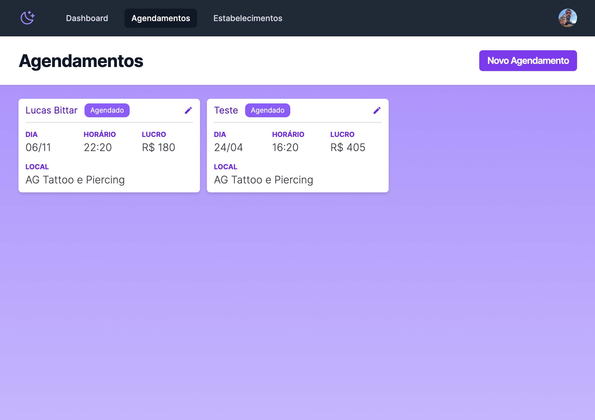
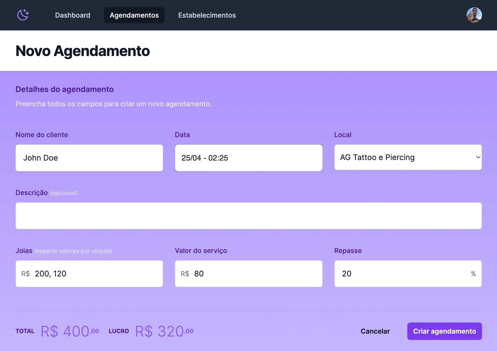

# Artist Dashboard

I started building this project to help my body-piercer friend to manage her clients. She was always forgetting about her appointments so I decided to help her out.
This dashboard mainly schedules appointments and the neat part is that it also adds a new event to her Google Calendar that way she gets notified and all that jazz.

Still a work in progress. My idea is to make this accessible to any artist so they can sign up and have their own dashboard to manager their own clients and appointments.

<h1 align="center">
  
</h1>

<h1 align="center">
  
</h1>

## Getting Started

First, run the development server:

```bash
npm run dev
```

Open [http://localhost:3000](http://localhost:3000) with your browser to see the result.
